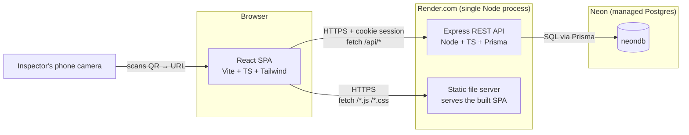
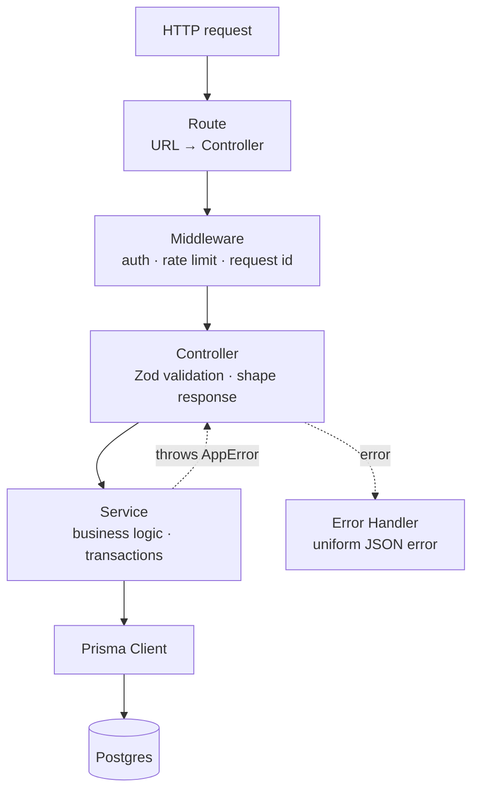
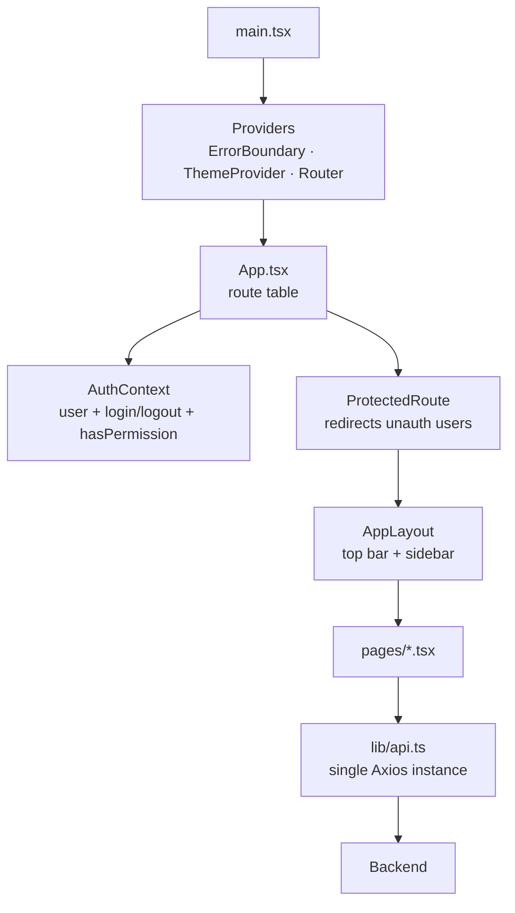
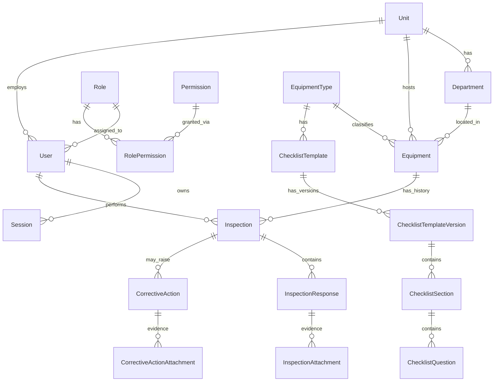
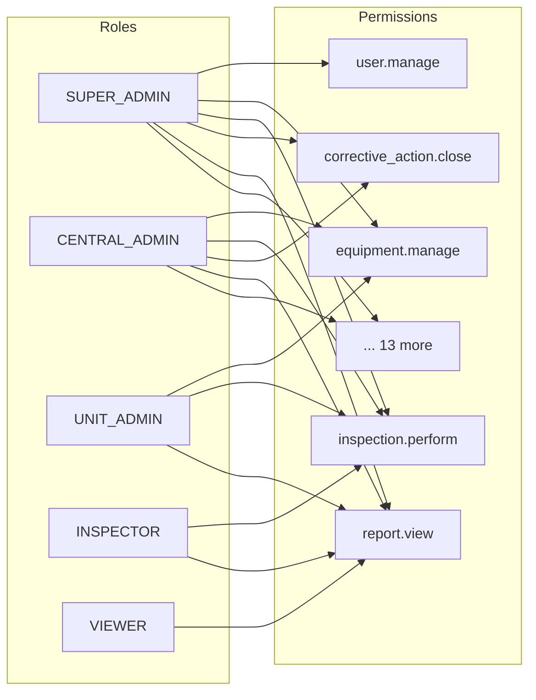
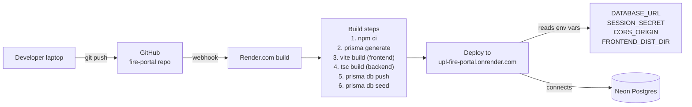

# SafetyVerse — Developer Guide

*A gentle, illustrated tour of the codebase for anyone joining the project.*

Read time: 20 minutes. By the end you'll know how the whole system fits
together and where to look when you need to change something.

---

## 1. What this application does

**SafetyVerse** (internally the UPL Fire Equipment Maintenance Portal) is
a role-based web app that helps a company track every piece of fire
safety equipment (extinguishers, hydrants, hoses, alarms, etc.) across
multiple plant units, and captures periodic inspections as immutable
digital records.

The typical workflow:

1. An admin loads the equipment master (each item has a unique QR code)
2. An admin defines a **checklist template** (questions per equipment type)
3. An inspector scans a QR code with their phone → the app opens on the
   matching equipment → they fill the checklist → submit
4. Failed answers automatically raise **corrective actions**
5. Every submitted inspection is stored with a unique number
   (`INS-2026-000042`) and shows up in reports + PDF exports

---

## 2. The 10,000-foot view



**Deployment topology in words:**

- One **web service** on Render's free tier runs a single Node process
- That process serves both `/api/*` (Express routes) and `/*` (the built
  React SPA static files) from the same origin
- The database is a managed Postgres on **Neon** (also free tier)
- Photos uploaded during inspections live on the Render container's
  local disk (ephemeral on the free tier — see §8 for how to fix that
  for a real rollout)

---

## 3. Repository layout

```
upl_project/
├── frontend/               # React + Vite SPA
│   ├── public/             # static assets (logo.jpeg, favicon)
│   ├── src/
│   │   ├── auth/           # AuthContext + ProtectedRoute
│   │   ├── components/     # ui.tsx, Modal, ErrorBoundary, DateRangeFilter
│   │   ├── layout/         # AppLayout (top bar + sidebar)
│   │   ├── lib/            # api client + one file per API area
│   │   ├── pages/          # one folder-less .tsx per route
│   │   │   └── reports/    # all 7 report pages
│   │   ├── theme/          # ThemeContext (light/dark toggle)
│   │   ├── App.tsx         # React Router routes
│   │   └── main.tsx        # ReactDOM entry
│   ├── index.html
│   ├── tailwind.config.js  # UPL orange brand palette
│   └── vite.config.ts
│
├── backend/                # Express + Prisma API
│   ├── prisma/
│   │   ├── schema.prisma   # data model (14 tables)
│   │   └── seed.ts         # idempotent demo data
│   ├── src/
│   │   ├── config/env.ts   # typed env-var loader
│   │   ├── controllers/    # one file per resource — thin HTTP layer
│   │   ├── services/       # one file per resource — business logic
│   │   ├── routes/         # one file per resource — URL → controller
│   │   ├── middleware/     # auth, rate limit, error handler, request id
│   │   ├── lib/            # cross-cutting: rbac, prisma, errors, exporters
│   │   ├── app.ts          # Express app setup
│   │   └── server.ts       # HTTP listener
│   └── package.json
│
├── docs/                   # you are here
├── logo.jpeg               # UPL brand image (also copied to frontend/public/)
├── render.yaml             # Render.com deployment blueprint
├── .gitignore
└── README.md
```

---

## 4. The two big layers

### 4.1 Backend — clean 4-layer stack



**Rule of thumb — where does new code go?**

| Kind of code | Layer | Example |
|--------------|-------|---------|
| "Bind /foo to the controller" | `routes/foo.ts` | `router.get('/', ctrl.list)` |
| "Validate input and shape output" | `controllers/fooController.ts` | Zod schema + `res.json({...})` |
| "Compute something / talk to DB" | `services/fooService.ts` | `prisma.foo.findMany(...)` |
| "Run before every request" | `middleware/xxx.ts` | attach user, rate limit |
| "Shared helper / no I/O" | `lib/xxx.ts` | date range parsing, RBAC keys |

**Never** call Prisma directly from a controller. **Never** call `res.json`
from a service. Keeps concerns clean.

### 4.2 Frontend — routes, hooks, one big Axios client



Every API call goes through **one Axios instance** in `lib/api.ts` so
cookies, base URL, timeout, and error normalisation are consistent.
Feature-specific wrappers live in `lib/apiInspections.ts`,
`lib/apiEquipment.ts`, etc.

---

## 5. Data model at a glance



**Fourteen tables** total. The full schema is in
`backend/prisma/schema.prisma` and each model has a comment explaining
what it's for.

**Key design decisions:**

- **Versioned checklists**: editing a template creates a new version.
  Historical inspections keep the exact version they were captured
  against, so a template edit never mutates history.
- **Snapshotted responses**: each `InspectionResponse` stores a copy of
  the question text + type at submission time — reports and PDFs render
  correctly even years later.
- **Unique period key** (`YYYY-MM`) enforces "one inspection per
  equipment per month" at the DB level with a unique index.
- **Inspection numbers** (`INS-2026-000042`) generated inside the
  submit transaction — monotonic per year, unique index.

---

## 6. Auth and RBAC in one page

### 6.1 Sessions

- User logs in with username + password → backend verifies bcrypt hash
- Backend creates a `Session` row → returns an HTTP-only **signed cookie**
  containing the session id
- Cookie is `secure` in production (HTTPS only), `sameSite: lax`
- On every subsequent request, middleware reads the cookie, looks up the
  session, hydrates `req.user` (or `null` if invalid / expired)
- Sessions have **sliding expiry** (default 8h idle, 30d absolute cap)

### 6.2 RBAC — 5 roles, 18 permissions



- **Every backend service** re-checks permissions AND scope (unit
  isolation for UNIT_ADMIN / INSPECTOR)
- **Frontend hides** nav items and controls the user can't access, but
  the backend is the source of truth

Full role/permission matrix is in [`RBAC.md`](RBAC.md).

---

## 7. End-to-end request walk-through

*An inspector opens a QR code on their phone → we submit an inspection.*

```mermaid
sequenceDiagram
    participant Phone as Phone camera
    participant SPA as React SPA
    participant API as Express API
    participant DB as Postgres

    Phone->>SPA: scans QR → GET /s/EQ-A1B2C3D4E5F6
    SPA->>API: GET /api/equipment/by-qr/EQ-A1B2...
    API->>DB: SELECT equipment WHERE qrCodeValue = ...
    DB-->>API: row
    API-->>SPA: 200 { equipment }
    SPA->>SPA: navigate /equipment/{id}
    SPA->>API: POST /api/inspections/start { equipmentId }
    API->>DB: BEGIN; find/create pending inspection
    DB-->>API: inspection row
    API-->>SPA: 200 { inspection }
    SPA->>SPA: navigate /inspections/{id}/perform
    Note over SPA: Inspector fills answers,<br/>uploads photos
    SPA->>API: PUT /api/inspections/{id} (save progress)
    SPA->>API: POST /api/inspections/{id}/submit
    API->>DB: BEGIN;<br/>update status=COMPLETED;<br/>assign inspectionNumber;<br/>auto-raise CAs for failures;<br/>COMMIT
    DB-->>API: ok
    API-->>SPA: 200 { inspection with number }
    SPA->>SPA: navigate /inspections/{id} (detail page)
```

---

## 8. Deployment (production)



**`render.yaml`** at the repo root is the source of truth for build +
start commands and env-var declarations. Every push to `main` on
GitHub triggers a rebuild automatically.

### Ephemeral disk caveat

Render's free tier wipes the container's filesystem on every restart
(~15 min idle spin-down or a fresh deploy). Structured data (users,
inspections, corrective actions) is safe in Neon. **Uploaded photos are
not**. For a real rollout, switch photo uploads to object storage
(Cloudflare R2 or S3) — see §10.

---

## 9. Local development

```bash
# 1. clone + install
git clone https://github.com/paramshah1903/fire-portal.git
cd fire-portal
(cd backend && npm ci)
(cd frontend && npm ci)

# 2. configure env
cp backend/.env.example backend/.env
# edit backend/.env — set DATABASE_URL to your Neon URL
#   (or a local Postgres) and set SESSION_SECRET to any random string

# 3. push schema + seed
cd backend
npx prisma generate
npx prisma db push --accept-data-loss
npx tsx prisma/seed.ts

# 4. run both processes (in two terminals)
cd backend && npm run dev            # http://localhost:4000
cd frontend && npm run dev           # http://localhost:5173
```

Log in with `admin` / `Admin@123` for a super-admin session.

---

## 10. Where to look when…

| I want to… | Look here |
|------------|-----------|
| Add a new API endpoint | `backend/src/routes/`, `controllers/`, `services/` |
| Add a new page | `frontend/src/pages/YourPage.tsx` + register in `App.tsx` |
| Change what a role can do | `backend/src/lib/rbac.ts` (single source of truth) |
| Change the theme colour | `frontend/tailwind.config.js` (`brand.*` scale) |
| Add a new report | `services/reportsService.ts` + `controllers/reportsController.ts` + `routes/reports.ts` + a new page in `pages/reports/` |
| Add a new equipment field | Prisma schema → migrate → controller Zod → service → frontend types → forms |
| Change frequency of scheduled inspections | `EquipmentType.inspectionFrequencyDays` (per-type) or `ChecklistTemplate.frequencyDays` (per-template override) |
| Add a new question type | `backend/src/lib/checklistTypes.ts` (the enum) + rendering in `InspectionPerformPage` |

---

## 11. Things to improve for a full production rollout

1. **Object storage for photos** — replace `multer.diskStorage()` with S3
   / R2 client. About half a day of work.
2. **Email / SMS / WhatsApp notifications** — pluggable in
   `services/notificationService.ts` (stub file exists). Recommend a
   provider like AWS SES + Twilio.
3. **Multi-instance HA** — the app is stateless; needs shared session
   storage (Redis) if scaled beyond one process.
4. **Enterprise SSO** — swap the password auth for SAML / OIDC in
   `services/authService.ts`. Roles still map to internal RBAC.
5. **Audit log retention** — currently indefinite; add a monthly
   cleanup job or archive to cold storage.
6. **CI pipeline** — GitHub Actions running `tsc` + tests + Prisma
   migrate check on every PR.

---

## 12. Further reading

- [`ARCHITECTURE.md`](ARCHITECTURE.md) — original architecture notes
- [`API.md`](API.md) — full endpoint catalogue
- [`DATABASE.md`](DATABASE.md) — schema deep-dive
- [`RBAC.md`](RBAC.md) — role/permission matrix
- [`DEPLOYMENT.md`](DEPLOYMENT.md) — Render + Neon step-by-step
- [`USER_MANUAL.md`](USER_MANUAL.md) — role-based end-user manual

Questions? The commit log tells the whole story of how each feature was
built — `git log --oneline` is a great starting point.
