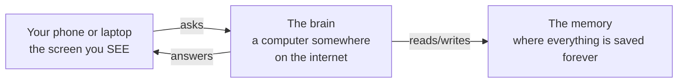
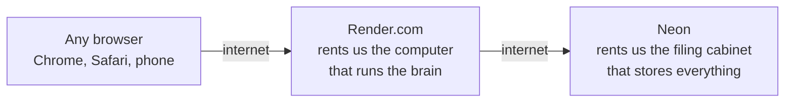
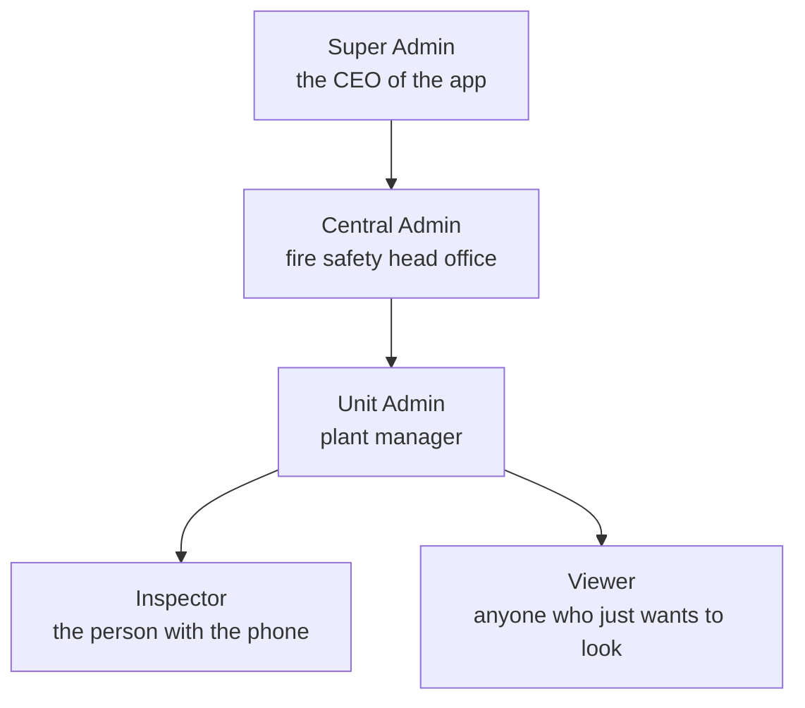
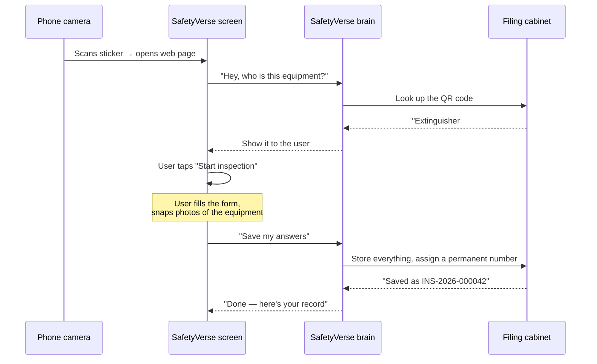
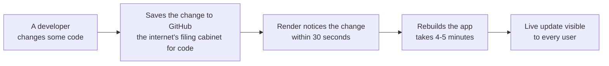

# SafetyVerse — The Really Simple Guide

*If you've never touched code in your life, this is for you. No jargon.
No assumed knowledge. Just plain English and pictures.*

---

## 1. What does this thing even do?

Think about how a **restaurant** works.

- Someone in the kitchen cooks the food.
- A waiter takes your order and brings your food.
- A cash register keeps track of every bill.

**SafetyVerse is the same idea, but for fire extinguishers.**

- Every fire extinguisher (or hydrant, or hose reel) gets a sticker
  with a **QR code** — like a name tag.
- Someone points their phone camera at the sticker.
- The phone opens a form asking "is this extinguisher OK?" — pass, fail,
  photo, done.
- The company's fire safety manager sees everything on one screen,
  from anywhere, live.

**That's it.** Everything else in this document explains the plumbing
behind that simple idea.

---

## 2. The three parts

Any app you've ever used — WhatsApp, Netflix, your bank app — has
**three parts**. Ours does too.



| Part | Real-world analogy | In SafetyVerse |
|------|--------------------|----------------|
| **The screen** | The waiter you talk to | The web page in your browser |
| **The brain** | The kitchen doing the work | A computer program running on rented servers |
| **The memory** | The restaurant's filing cabinet | A database that never forgets anything |

**Nothing more than that.** Three parts talking to each other.

---

## 3. Where do the parts live?

We rent all three from other companies. We didn't buy any servers.



- **The screen** — lives on the same rented computer as the brain
  (they're bundled together)
- **The brain** — runs on **Render.com**. Free tier. It's like renting
  a small apartment for the app to live in.
- **The memory** — lives on **Neon**. Also free tier. A safe filing
  cabinet in the cloud.

Both companies charge zero dollars for what we're using right now.
When SafetyVerse gets big enough to matter, we'll pay them a few
dollars a month.

---

## 4. What lives in the filing cabinet?

The database is just **14 lists**. Each list is like a spreadsheet with
a few columns.

Here are the important ones:

| List | What's in it | Real-world equivalent |
|------|--------------|----------------------|
| **Users** | Everyone who can log in | Employee directory |
| **Roles** | 5 types: super admin, inspector, etc. | Job titles |
| **Units** | Every UPL plant location | Branch offices |
| **Departments** | Sub-areas inside a plant | Rooms in a branch |
| **Equipment** | Every fire extinguisher, hydrant, etc. | The physical stuff |
| **Equipment Types** | Categories (extinguisher, hydrant, ...) | Product catalogue |
| **Checklist Templates** | The questions to ask | Blank forms |
| **Inspections** | One record per equipment × month | Filled-in forms |
| **Corrective Actions** | Follow-ups when something fails | To-do list |

The lists **connect to each other**. For example, every "inspection"
knows which "equipment" it belongs to, which "person" did it, and
which "unit" it happened at. So we can ask questions like *"show me
every failed inspection at Plant 7 last month"* and get an answer in a
fraction of a second.

---

## 5. Who's allowed to do what?

Not everyone can do everything. There are **5 kinds of users**.



| Role | What they can do | Analogy |
|------|------------------|---------|
| **Super Admin** | Everything, everywhere | Owner of the restaurant |
| **Central Admin** | Manage forms + all inspections, but not create users | Head chef |
| **Unit Admin** | Everything **inside their unit only** | Restaurant manager |
| **Inspector** | Just do inspections in their unit | Waiter |
| **Viewer** | Read only. Can look, cannot change | Customer reading the menu |

The app **hides menus** you're not allowed to use. And even if you try
to sneak in through the back door, the brain rejects you. Two layers
of safety.

---

## 6. What actually happens when you scan a QR code?

Let's follow one inspection from start to finish.



**That's the whole flow.** Six steps. Under 60 seconds if the inspector
knows what they're doing.

If any answer was a "fail", the brain automatically creates a
**follow-up task** so no one forgets to fix it. That's the killer
feature.

---

## 7. What's inside the code repository?

The whole thing is just **two folders**.

```
upl_project/
├── frontend/   ← the screen the user sees
└── backend/    ← the brain
```

Inside each, code is organised into small folders by what it does. You
don't need to know the details unless you're changing the code. If
you're changing the code, read the [full developer guide](DEVELOPER_GUIDE.md).

**One important number:** the whole app is about **20,000 lines of
code**. That's tiny for what it does. Enterprise apps often run into
the millions.

---

## 8. How do updates get released?

We use a system called **Git**. Think of it as **track changes**, but
for code.



Every time a developer saves an improvement, the app rebuilds
automatically and the new version goes live. No downtime. Users just
refresh the page.

If something breaks, we can **rewind time** — Git remembers every
version and we can put an older one back within a minute.

---

## 9. What does it cost to run?

**Right now, for the pilot: $0 per month.** Everything's on free tiers.

Once we roll out to lots of units, costs go up a little:

| Stage | Monthly cost |
|-------|--------------|
| **Pilot (right now)** | $0 |
| **One region live** | ~$60 |
| **All India live** | ~$105 |
| **Full company worldwide** | ~$400 |

For comparison: a **single manual audit** costs way more than that per
month. And we do zero paper.

---

## 10. What could break, and what happens if it does?

Every part of the system has a plan for when it breaks.

| If this breaks... | What happens | Fix |
|-------------------|--------------|-----|
| **The screen (browser)** | User sees an error message | Refresh the page |
| **The brain (Render)** | App goes down | Renders another copy — usually back in 30 seconds |
| **The filing cabinet (Neon)** | Nothing loads | Neon has automatic backups. We restore. |
| **A specific feature** | That page shows an error | Developer looks at logs, ships a fix |
| **A photo we uploaded** | Photo disappears | Real risk on the free tier — see below |

**One real limitation right now:** on the free tier, photos uploaded
during inspections might disappear if the app restarts (roughly once a
day). The important data — who did what inspection when — is safe in
the filing cabinet forever. Photos need a small upgrade for the enterprise
rollout: about half a day of work.

---

## 11. What's next?

This is a **pilot**. It works today. It's live at
<https://upl-fire-portal.onrender.com>.

For the enterprise rollout, we need three things:

1. **Executive sign-off** to make it the official system of record
2. **A tiny budget** (see cost table above) to move off the free tier
3. **Two people** to help roll it out to each unit — training + onboarding

Once those are done, we scale from **1 unit → all of UPL** in about
6 months. Full plan is in the executive deck (`docs/presentation/`).

---

## 12. Where do I look if I want to learn more?

| I want to... | Read this |
|--------------|-----------|
| Understand the code in depth | [DEVELOPER_GUIDE.md](DEVELOPER_GUIDE.md) |
| Use the app as an inspector / admin | [USER_MANUAL.md](USER_MANUAL.md) |
| Pitch this to my boss | [presentation/SafetyVerse_Executive_Deck.pptx](presentation/SafetyVerse_Executive_Deck.pptx) |
| Deploy it somewhere new | [DEPLOYMENT.md](DEPLOYMENT.md) |
| Just try it right now | Open <https://upl-fire-portal.onrender.com> and log in as `admin` / `Admin@123` |

---

**That's the whole system in one document.** No hidden magic. No fancy
words. Just a screen that talks to a brain that talks to a filing
cabinet, wrapped in a nice orange colour and stuck on a QR code.
